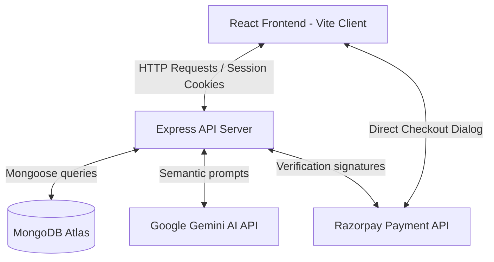

# ShopEase - Premium E-Commerce Ecosystem

ShopEase is a state-of-the-art, full-stack e-commerce application constructed using the MERN stack (**MongoDB, Express, React, Node.js**). Designed with modern visual aesthetics, the application includes signature-verified payments, an AI-powered customer support chatbot, and personalized catalog search recommendations.

---

## 📌 Table of Contents

1. [System Architecture](#-system-architecture)
2. [Workflow & Integration Model](#-workflow--integration-model)
3. [Ecosystem Credentials (Authentication)](#-ecosystem-credentials-authentication)
4. [Razorpay Payment Gateway Details](#-razorpay-payment-gateway-details)
5. [Ecosystem Features](#-ecosystem-features)
6. [Tech Stack](#-tech-stack)
7. [Environment Configurations](#-environment-configurations)
8. [Quick Start & Setup](#-quick-start--setup)
9. [Available Commands](#-available-commands)

---

## 🏗️ System Architecture

ShopEase is partitioned into three unified layers:
- **Client (Frontend)**: React Single Page Application (SPA) powered by Vite, styled with modern Vanilla CSS gradients, glassmorphism layers, and responsive grids.
- **API Server (Backend)**: Express.js server managing authentication sessions, transaction logs, user feedback, and AI pipelines.
- **Database (MongoDB)**: Structured data layer containing product models, transaction histories, user logs, and chat records.



---

## 🔄 Workflow & Integration Model

1. **Authentication Flow**:
   - The user registers or logs in via Passport local authentication or Google OAuth.
   - Upon success, an HTTP-only JWT token is generated and stored securely in the browser cookies.
2. **Search & Recommendation Engine**:
   - When a user performs a search, the query parameter (`?search=query`) is synced with the URL.
   - The frontend calls the search endpoint, which runs a TF-IDF analysis based on product titles and descriptions to return matches in real-time.
3. **Transaction Flow (Razorpay)**:
   - When a user clicks **Buy Now**, the client fetches the Razorpay public key and initiates order creation on the backend.
   - The backend requests a secure Order ID from Razorpay and returns it.
   - The Razorpay checkout dialog launches immediately over the product page.
   - Upon successful authorization, Razorpay returns signatures which are verified on the backend before completing the transaction.

---

## 🔐 Ecosystem Credentials (Authentication)

Use the following accounts to access pre-seeded buyer logs and listings:

| Role | Email | Password |
|------|-------|----------|
| **User 1** | `ankit1@gmail.com` | `Ankit@1234` |
| **User 2** | `Test@gmail.com` | `Test@123` |

*Note: You can also register new accounts dynamically or trigger `node seed.js` in the `backend` folder to generate 50 mock users with simulated purchases and reviews.*

---

## 💳 Razorpay Payment Gateway Details

### ⚠️ Transaction Limits
> [!IMPORTANT]
> **Razorpay test accounts enforce a hard transaction limit: payments above ₹30,000 are not allowed.**
> Products priced above ₹30,000 will fail order creation checks on the payment gateway due to sandbox security restrictions.

### 💳 Simulated Sandbox Test Cards
Use the following credentials in the Razorpay payment dialog to authorize test transactions:

| Network | Card Number | CVV & Expiry |
|---------|-------------|--------------|
| **Visa** | `4100 2800 0000 1007` | Random CVV, Any Future Date |
| **Mastercard** | `5500 6700 0000 1002` | Random CVV, Any Future Date |
| **RuPay** | `6527 6589 0000 1005` | Random CVV, Any Future Date |
| **Diners** | `3608 280009 1007` | Random CVV, Any Future Date |
| **Amex** | `3402 560004 01007` | Random CVV, Any Future Date |

---

## 🌟 Ecosystem Features

- **Google Gemini Support Chatbot**: Frosted glass floating chatbot delivering immediate support queries, referencing product parameters.
- **Standardized Sizing Details**: Responsive product page structures with hidden native scroll blocks.
- **Glassmorphic Navigation**: Dynamic blurred headers containing URL parameters for persistent back-navigation transitions.
- **Dynamic Switcher Tabs**: Pill-shaped profile controls for seamless order history tracking.

---

## 🛠️ Tech Stack

- **Frontend**: React (Vite), React Router DOM v7, CSS Variables, Dicebear SVG avatars.
- **Backend**: Node.js, Express, Passport.js (JWT + OAuth), Mongoose, Multer, Natural.js.
- **Services**: MongoDB Atlas, Razorpay API, Google Gemini AI API, Cloudinary.

---

## ⚙️ Environment Configurations

### Backend Configuration (`backend/.env`)
Create a `.env` file in the `backend/` directory:
```env
MONGODB_URI=mongodb+srv://...  # MongoDB connection string
GOOGLE_CLIENT_ID=...          # Google Sign-in Credentials
GOOGLE_CLIENT_SECRET=...      # Google Sign-in Secrets
RAZORPAY_KEY_ID=...           # Razorpay API Test Key ID
RAZORPAY_KEY_SECRET=...       # Razorpay API Test Secrets Key
GEMINI_API_KEY=...            # Google Gemini AI Endpoint Key
FRONTEND_URL=http://localhost:5173
JWT_SECRET=...                # Cryptographic authentication signature word
PORT=5001                     # Backend Port (re-mapped to avoid Airplay conflicts)
NODE_ENV=development
```

### Frontend Configuration (`frontend/.env`)
Create a `.env` file in the `frontend/` directory:
```env
VITE_API_BASE_URL=http://localhost:5001
```

---

## 🚀 Quick Start & Setup

### Unified Installation
From the project root workspace, install dependencies in both environments:
```bash
npm run setup
```

### Starting the Application
Launch both the backend server and Vite client concurrently in development mode:
```bash
npm run dev
```
The application will launch on:
- Frontend Client: `http://localhost:5173/`
- Backend server: `http://localhost:5001/`

---

## 📦 Available Commands

- `npm run dev` - Runs client and server processes concurrently.
- `npm run setup` - Installs root, frontend, and backend packages.
- `npm run clean` - Deletes all node_modules recursively.
